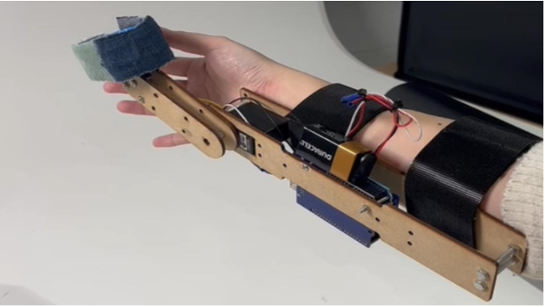
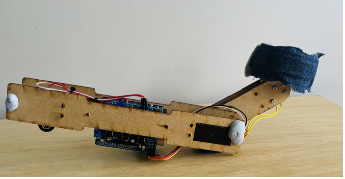
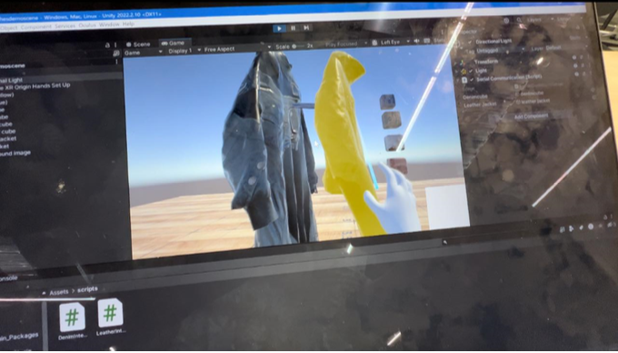

# Wearable Controller with Texture Feedback

### A Texture based Controller for Multitouch Interaction

## ABSTRACT

As the visual contents of virtual reality have advanced significantly,
Research in HCI has addressed improving a range of haptic feedback
other than vibrotactile feedback. This study focuses on texture hap-
tic feedback and improving users’ holistic experience of receiving
texture feedback. Our wearable texture feedback controller enabled
users to receive texture haptic feedback in a manner that resembles
their real-life experience. As the name suggests, the controller is
attached to a user’s wrist, and the wheel with texture elements
comes up only when the user touches an object in VR. This design
allows users to feel texture feedback with their whole hands, which
improves the user experience of VR compared to previous research
in which users place one fingertip to feel the feedback.

## KEYWORDS

```
Virtual Reality, Haptic feedback, Wearable device, Texture feedback
```

## 1 INTRODUCTION

In cartoons and movies, many fictional characters use ‘cool’ tools
to show examples of what people dream of, such as a time travel
machine. Developing these dream tools then seemed impossible,
but some became real in the 21st century. Virtual Reality (VR) is
one example. Although movies showed that characters in the story
wear goggles to walk around a virtual world, many people did not
expect to immerse themselves in the world of games.
Since the arrival of VR, the quality of VR has improved signifi-
cantly. However, while VR’s visual content has been enhanced for
over a decade, the haptic feedback rendered for commercial VR is
only vibrotactile feedback [ 3 ]. Many companies have invested in
developing VR controllers that generate different types of haptic
feedback other than vibration. Teslasuit produced wearable suits
that give users more detailed feedback, such as tense and nerve
stimulation [ 10 ]. These new technologies are available to everyone
to order online, although it costs more than 10 thousand dollars,
which is unaffordable to most people. Many researchers worked on
generating different types of haptic feedback. Still, most of them
focus on generating accurate feedback, and these controllers do not
always consider how people actually touch objects in real life. For
example, people use their entire hand to examine the roughness of
the surface in real-life situations rather than using one fingertip.
However, a hand-held VR controller generating texture feedback
was designed for users to place a finger on a material to experience
the feedback [1].
To address such limitations of haptic feedback of VR controllers,
we developed a wearable texture feedback controller that enables
users to feel materials with their entire hand, enhancing the user
experience in VR, which was not always shed light on in developing
VR.
This paper makes the following contributions:

1. We developed a wearable texture feedback controller that
enables users to feel materials they touch in VR in a manner that
resembles their real-life experience.
2. We addressed improving the user experience in VR, which is
not often given consideration in the early stage of prototyping in
other research.

## 2 BACKGROUND RESEARCH

As the technologies have advanced, many researchers and compa-
nies have researched producing different haptic feedback for VR
controllers beyond vibrotactile feedback, including thermal, gravity,
pressure and texture. We will look at prior research to discover how
texture haptic feedback systems have been developed and their
challenges. Culbertson et al.[ 4 ] recorded data of users’ motions on
different types of surfaces and created haptic texture models from
it using vibrotactile feedback. The research did not come with the
results of user testing, which made it unclear whether users were
satisfied with the quality of the feedback. The other research built
a novel technology that generates texture feedback using vibration
[ 9 ]. This research created an algorithm to generate more realis-
tic feedback measured with three different categories; granularity,
amplitude and timbre. The fineness of the feedback did not affect
the result. Rather amplitude and timbre do matter. These studies
played a vital role in exploring the possibilities of producing haptic
textures with vibrotactile feedback.
The trend of studies of texture haptic feedback shifted towards
non-vibrotactile generated recently. Shifting away from vibrotac-
tile feedback, Kyung and Lee [ 7 ] employed a tactic array together
with vibration to generate more accurate shape rendering. This
allowed users to feel texture and vibration when using a pen-shape
controller on the tablet. Advancing tactic array technology, many
studies were able to generate different texture feedback in different
ways. Benko et al. [ 3 ] 4 x 4 actuated pins were used on the surface
of the finger-tip size controller generating the texture of each object.
However, user testing showed the feedback produced by 16 pins
was not as accurate as they expected.
Previous research showed two different ways to implement con-
trollers with a multi-surface head producing texture feedback; a
hand-held device or a robot arm. Araujo et al.[ 2 ] built a robotic arm
mounted on a flat surface to generate texture feedback. This con-
troller tracks users’ hands, enabling them to develop three different
types of feedback. The texture feedback head can be mounted on
the robotic arm, and it touches the user’s hand when they are close
enough to an object in VR, and then it moves freely with their hand.
It enabled the free-hand controller to render different feedback,
but its movement was limited as it needed to be mounted on a flat
surface. Whitmire et al. [ 1 ] developed a hand-held controller with
a similar mechanism as Araujo et al. using a multi-surface head. A
wheel on the controller rotates and gives a user texture feedback for
an object they touch in VR. This controller’s significance was the
feedback’s accuracy compared to prior research and no contact with
the user’s fingertip when they were not feeling materials. Handheld
devices in previous studies constantly touched users’ fingers even
when they released their hands from objects in VR [4,5]. However,
Whitmire et al. [ 1 ] added a motor to move the wheels up only when
users contact an object in VR. It made the feedback more realistic.
However, this haptic controller was designed for users to put a
fingertip on the wheel to experience haptic feedback, which does
not resemble typical real-life interactions.
It becomes evident that many of them focused on enhancing
the accuracy of their feedback to improve user experience in VR.
Yet more research needs to be conducted to explore how altering
the delivery of feedback can boost the user experience of VR. A
study investigating how humans show their emotions through
squeezing found that people generate nuanced touch to convey
different emotions [ 8 ]. Other research invented VR controllers for
different types of squeezing sensations to explore how such subtle
touch communication can be generated by VR haptic controllers
[ 6 ]. These studies shed light on the importance of considering every
detail of VR controllers to achieve more realistic haptic feedback
experiences.
Learning from these previous studies, this study aimed to en-
hance users’ experience of feeling texture feedback. The prior re-
search showed the limitations of hand-held devices and robot arms
for VR controllers producing texture feedback. We built a wearable
controller. Our hypothesis is as follows: The controller, allowing
users to use their hands freely, enhances their experience of VR tex-
ture haptic feedback, closely resembling the interaction of touching
objects in real life.

## 3 DESIGN AND IMPLEMENTATION

The design goal and aim of our wearable texture feedback controller
was for it to be more hands-free and interactive. Our goal and aim
were predominantly derived from existing research around texture-
based haptic controllers, which is explored in detail below. Our
controller was developed in a way where it could be used for multi
finger interaction that renders finger haptics when used within a
virtual environment. For the purposes of this project, we decided
to develop a ‘shopping experience’ virtual environment demo for
the controller. In this demo, users would use their fingers to touch
and feel a clothing item. When that item is touched, the controller
spins the wheel to that selected texture under the fingertips. The
wheel that we developed is interchangeable and contains physical
clothing textures to provide haptic sensations to the user.

## 3.1 Wearable Texture Feedback Controller

We based the Wearable Texture Feedback Controller on Haptic
Revolver. Instead of the controller being handheld, we questioned
how we could make the current Haptic Revolver more novel and
interactive. Hence we designed our controller to instead be hands-
free and wearable on the arm. This would allow the user to interact
with the controller using more fingers (figure 2). This controller,
similar to Haptic Revolver, uses a wheel with textural elements on
it and raises and lowers in response to its position in the virtual
environment demo. In the following sections below, we describe
the hardware and software components of the controller.

 \
Figure 1: Wearable Texture Feedback Controller

## 3.2 Hardware Design and Implementation

We arrived at the design of the Wearable Texture Feedback Con-
troller through an iterative process where each design that was
created improved in terms of functionality and ergonomics. Our
final design (figure 3) was created using many elements. The arm
component was developed using a laser cutter with 3mm plywood
material. The 60 mm wheel was designed in Fusion 360 and 3D
printed. The controller has two degrees of freedom, each of which
is actuated by a specific motor. A servo motor was used to raise and
lower the wheel along the arm component, while the wheel itself
used a DC motor. The DC motor was held together by screws and
bolts to keep the wheel connected to the arm component and for
the motor to also remain in place. In terms of other main hardware
components, Arduino was fixed to the middle of the controller for
motor control and code input. The Arduino part of the controller
connects to a PC through a USB link and is powered by a battery.

 \
Figure 2: Final Design of Wearable Texture Feedback Controller

## 3.3 Software Design and Implementation

C++ code with specialised functions and libraries were predomi-
nantly used to control the movement of the DC motor and Servo
motor for both the arm component and wheel accordingly. In terms
of Unity and its integration with Arduino, C# (sharp) was used. This
was done to integrate the controller with Unity for the ‘shopping
‘experience’ demo to work properly. The Unity, Arduino and VR
integration is explored in further detail below.

 \
Figure 3: VR ’Shopping Experience’ Demo with Hands Tracking

## 3.4 Unity, Arduino and VR Integration

Arduino and Unity were programmed together. Unity sends an
event to Arduino whenever an object, which in this case was a
clothing item, is hovered upon in the developed scene of Unity.
The said event is then used to send information to Arduino, which
acts upon it. If the object is hovered upon, the wheel moves up
towards the fingers of the user. If not hovered upon, the wheel
moves back down. Arduino was needed to know which material
is being touched to actually turn the wheel and bring it to the
desired texture. To create the ‘shopping experience’ demo, a Meta
VR headset and Unity were used. The VR headset connects to the
PC through a USB connection. Multiple libraries, including XR
interaction toolkit and XR hands, were downloaded in Unity to
visualise hand tracking through the VR (figure 4). This helped to
track the controller. To obtain the shopping experience demo, a
clothing store asset was downloaded for clothing items and textures.
The integration of Unity, Arduino and VR headset allowed for the
controller to function in the way we initially intended, matching the
aim and goals for the design and implementation of our Wearable
Texture Feedback Controller.

## 4 DEMO APPLICATIONS

Our wearable controller can be used for several applications which
require texture feedback, such as a virtual clothing store, virtual
housing materials store and virtual games with surface-based inter-
action. These applications will be further discussed below.

## 4.1 Virtual Clothing Store

Customers can explore and interact with virtual clothing products
in a unique way using a texture-based VR controller in a clothes
store setting. Through haptic feedback, these controllers allow users
to simulate touch and feel the textures of various materials, such
as cotton, silk, or denim. Customers may feel the softness and
texture of the fabrics as if they were physically present by gliding
their hands or fingers over the virtual apparel exhibited in the VR
environment. With the help of this technology, customers may
have a more enjoyable and realistic shopping experience, making
more confident decisions about the fabrics they want. Additionally,
it gives the clothing business a chance to highlight the variety of
textures they provide, encouraging buyers to explore textures more
thoroughly as they look for the ideal outfit.

## 4.2 Virtual Building Supplies Store

An engaging and interactive way for customers to interact with the
products is introduced through a texture-based VR controller in a
store selling building supplies for houses. This controller features
haptic feedback, which enables users to realistically touch and
feel different building materials like tiles, wallpaper, and flooring
alternatives. Customers can explore the various surfaces in a virtual
world, feeling the smoothness of marble, the roughness of stone,
or the patterns of wood grain. With the use of this technology,
customers have a rare chance to evaluate the materials both visually
and physically to get a genuine idea of how they would seem and
feel in their own homes. Customers can confidently select the ideal
building materials that complement their personal aesthetic and
style preferences with the texture-based VR controller, offering a
completely immersive and individualised purchasing experience.

## 4.3 Virtual Games With Haptic Feedback

For virtual games featuring surface-based interaction, a texture-
based VR controller presents a novel way to improve immersion
and gaming dynamics. In order to replicate the feel and texture of
various surfaces within the virtual game world, these controllers use
haptic feedback. Virtual objects and environments can be physically
touched and interacted with by players, who can feel the textures of
smooth, bumpy, rough, and slippery surfaces with their fingertips.
For instance, while navigating and grasping various handholds
in a virtual climbing game, players can feel the texture of rock
surfaces. Players can find hidden clues in a puzzle game by sensing
changes in surface textures. In a racing game, players can also
feel the roughness of various road surfaces, like asphalt or gravel,
which affects how their car handles. Game designers can build more
immersive and compelling experiences by utilising texture-based
VR controllers, where surface interactions become an essential
component of the gaming mechanics.


## 5 DISCUSSION

We designed our new controller to integrate into existing VR sys-
tems, and the fundamental objective of the controller is to enrich
user’s virtual reality experience by providing them with a better
sense of touch. Our Controller creates an immersive experience
where users can interact with objects in VR in a manner resembling
their real-life experience, allowing them to use their entire hand.
Although we did not conduct usability testing to investigate how
accurate feedback can be conveyed to users, people at the show-
case at the University of Melbourne got excited when they first felt
materials with our controller. They were able to feel the correct
material corresponding to objects in VR (figure 4).

## 5.1 Challenges

We must recognise the challenges and constraints remaining despite
having made some significant progress on this project.
The range of simulated materials is limited: We can only use
our system to simulate a range of fabrics commonly used in ev-
eryday wear. However, this controller only conveys two different
materials at the same time, although interchangeable wheels with
different materials were developed. Users needed to change the
wheels depending on the materials in VR.
Accuracy of haptic feedback: Although our controller can imi-
tate different fabric textures, the accuracy of the movement of the
controller should be improved in future. When the wheel rotated
and came up to show the material a user was touching, the user
sometimes placed their hands in between these fabrics, which did
not represent the feedback they should receive from one fabric.
When we presented our controller at the showcase, we needed to
ask users to move slowly to have more accurate feedback. It showed
us room for improvement, which is the response speed of the wheel
coming up to users’ hands.
Comfort and ease of use: Our goal was to make our devices as
comfortable and user-friendly as possible, but one’s unique hand
shape or personal preference might lead to different experiences.
For instance, the size of the wheel was fixed, and it was too small
for people with large hands. Although we designed the attachment
parts as flexible to adjust where the wheel should be set for every-
one, some fixed parts could have been designed to accommodate a
range of users.

## 5.2 Future Work

We have taken cognisance of the constraints and hence plan to
improve our controllers soon. In regards to work in the future, this
is what we envision. The use of advanced haptic systems can help
to simulate physical fabric textures, and we can develop more accu-
rate textures in the future with additional research on how we can
improve and further refine current methods. With the possibility of
simulating a wide variety of materials aside from just cloth texture
alone with this technique, we could potentially replicate metal or
wood as well. For example, Günther et al. [ 5 ] produced different
roughness using the same material and adjusting the frictions. If
we were able to add this system on our wearable controller, we can
generate texture feedback for multiple materials with one wheel.
We need to conduct user testing to analyze how accurately this con-
troller responds to the actions of users in VR. It is worth checking
the quality of feedback in terms of the angle of wheels, speed of
the wheel’s rotation, and the number of materials.

## 6 CONCLUSION

We presented our wearable texture feedback controller that re-
sponds to users’ movements in VR accurately and generates texture
feedback corresponding to the object they interact with in VR. The
project has two significance: First, we considered how people in-
teract with objects in real life, leading us to make our controller a
wearable device. In this way, we achieved to produce seamless and
immersive experiences in which users can feel texture elements in
VR in a manner that resembles their real-life experience. Although
user testing is required to improve this system iteratively to gener-
ate more accurate feedback, we showed that well-thought design
considerations could enhance the user experience of VR haptic
feedback.

## REFERENCES

[1]Bruno Araujo, Ricardo Jota, Varun Perumal, Jia Xian Yao, Karan Singh, and
Daniel Wigdor. 2016. Snake Charmer: Physically Enabling Virtual Objects. In
Proceedings of the TEI ’16: Tenth International Conference on Tangible, Embedded,
and Embodied Interaction(Eindhoven, Netherlands)(TEI ’16). Association for
Computing Machinery, New York, NY, USA, 218–226. https://doi.org/10.1145/
2839462. \
[2]Bruno Araujo, Ricardo Jota, Varun Perumal, Jia Xian Yao, Karan Singh, and
Daniel Wigdor. 2016. Snake Charmer: Physically Enabling Virtual Objects. In
Proceedings of the TEI ’16: Tenth International Conference on Tangible, Embedded,
and Embodied Interaction(Eindhoven, Netherlands)(TEI ’16). Association for
Computing Machinery, New York, NY, USA, 218–226. https://doi.org/10.1145/
2839462. \
[3]Hrvoje Benko, Christian Holz, Mike Sinclair, and Eyal Ofek. 2016. NormalTouch
and TextureTouch: High-Fidelity 3D Haptic Shape Rendering on Handheld Virtual
Reality Controllers. InProceedings of the 29th Annual Symposium on User Interface
Software and Technology(Tokyo, Japan)(UIST ’16). Association for Computing Ma-
chinery, New York, NY, USA, 717–728. https://doi.org/10.1145/2984511. \
[4]Heather Culbertson, Juliette Unwin, Benjamin E. Goodman, and Katherine J.
Kuchenbecker. 2013. Generating haptic texture models from unconstrained
tool-surface interactions. In2013 World Haptics Conference (WHC). 295–300.
https://doi.org/10.1109/WHC.2013. \
[5]Sebastian Günther, Julian Rasch, Dominik Schön, Florian Müller, Martin Schmitz,
Jan Riemann, Andrii Matviienko, and Max Mühlhäuser. 2022. Smooth as Steel
Wool: Effects of Visual Stimuli on the Haptic Perception of Roughness in Virtual
Reality. InProceedings of the 2022 CHI Conference on Human Factors in Computing
Systems(New Orleans, LA, USA)(CHI ’22). Association for Computing Machinery,
New York, NY, USA, Article 399, 17 pages. https://doi.org/10.1145/3491102.
3517454 \
[6]Aakar Gupta, Antony Albert Raj Irudayaraj, and Ravin Balakrishnan. 2017. Hap-
ticClench: Investigating Squeeze Sensations Using Memory Alloys. InProceedings
of the 30th Annual ACM Symposium on User Interface Software and Technology
(Québec City, QC, Canada)(UIST ’17). Association for Computing Machinery,
New York, NY, USA, 109–117. https://doi.org/10.1145/3126594. \
[7]Ki-Uk Kyung and Jun-Young Lee. 2009. Ubi-Pen: A Haptic Interface with Texture
and Vibrotactile Display.IEEE Computer Graphics and Applications29, 1 (2009),
56–64. https://doi.org/10.1109/MCG.2009. \
[8]Sara Price, Nadia Bianchi-Berthouze, Carey Jewitt, Nikoleta Yiannoutsou, Kate-
rina Fotopoulou, Svetlana Dajic, Juspreet Virdee, Yixin Zhao, Douglas Atkinson,
and Frederik Brudy. 2022. The Making of Meaning through Dyadic Haptic Af-
fective Touch.ACM Trans. Comput.-Hum. Interact.29, 3, Article 21 (jan 2022),
42 pages. https://doi.org/10.1145/ \
[9]Paul Strohmeier and Kasper Hornbæk. 2017. Generating Haptic Textures with
a Vibrotactile Actuator. InProceedings of the 2017 CHI Conference on Human
Factors in Computing Systems(Denver, Colorado, USA)(CHI ’17). Association for
Computing Machinery, New York, NY, USA, 4994–5005. https://doi.org/10.1145/
3025453. \
[10] VR Electronics Ltd. 2023. TESLASUIT. https://teslasuit.io/

